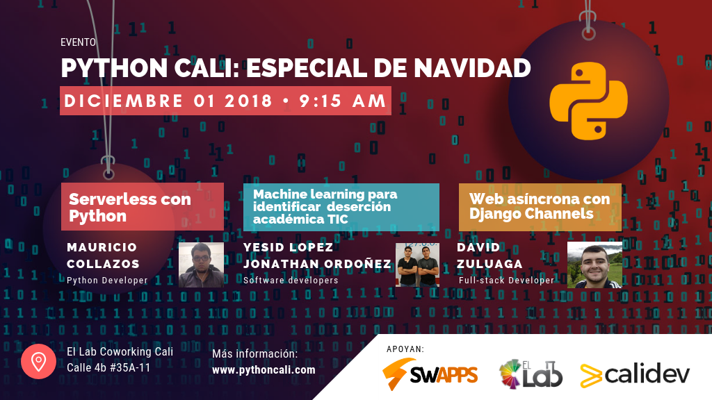

# Questions-realTime
Pequeño ejemplo para la charla de Django Channels en la Meetup de Python Cali 1ro de Diciembre

# Paso a paso de la instalacion

1) Crear ambiente virtual (virtualenv o virtualwraper)
2) Ingresar al ambiente virtual
3) Clonar el proyecto git clone https://github.com/dafer154/questions-realtime.git
4) Instalar requerimientos pip install -r requirements.txt
5) Migrar la base de datos python manage.py migrate
6) Crear super usuario python manage.py createsuperuser
7) migrar los datos iniciales python manage.py loaddata db.json
8) Correr proyecto python manage.py runserver

Disfrute de esta aplicación con amor <3

By: David Fernando Zuluaga

